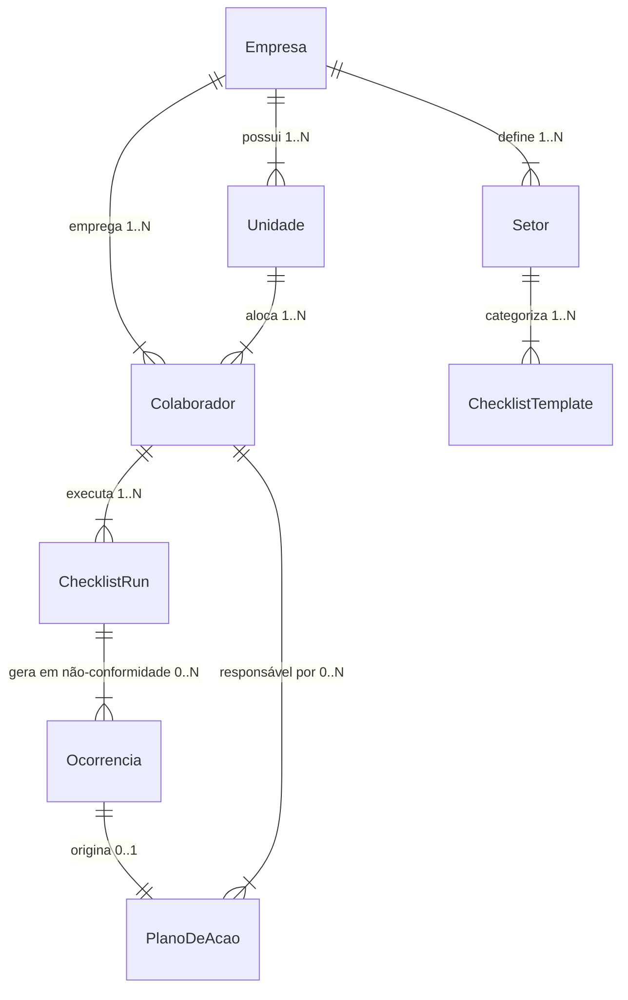
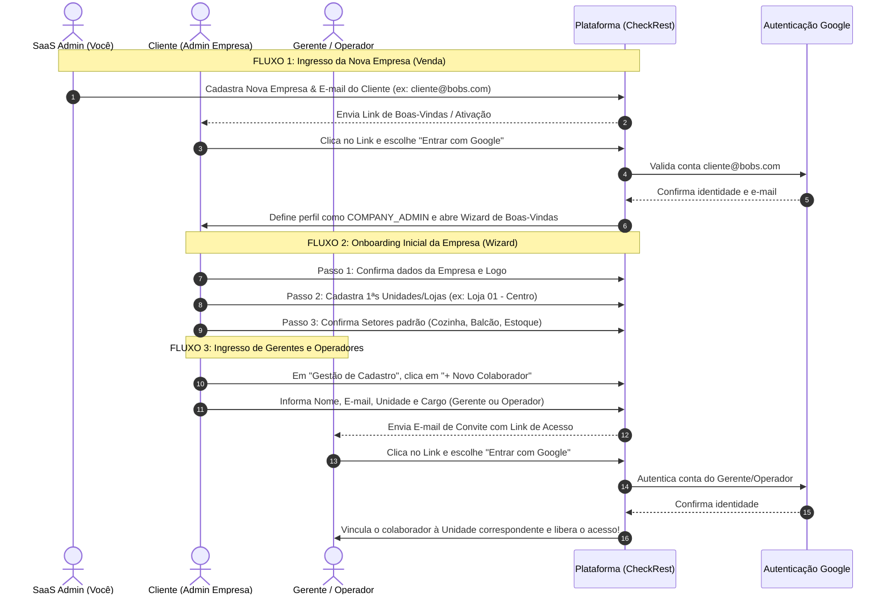

# Plano de Implementação e Simplificação para Testes (Piloto)

Este documento detalha o plano de ajustes e simplificações do sistema para a fase de testes e validação com cliente, além do **Plano de Uso** detalhado com rotas, permissões e conexões entre os módulos.

---

## 1. Visão Geral das Alterações

Para garantir entregas incrementais seguras e focadas nas rotinas essenciais de auditoria e operação, realizaremos:
1. **Ocultar Módulo "Documentos & POPs":** Remover o acesso no menu lateral para focar a validação do cliente em Checklists, Ocorrências, Planos de Ação e Cadastros.
2. **Transformar "Colaboradores" em "Gestão de Cadastro":**
   - Agrupar no mesmo módulo a gestão centralizada de **Unidades**, **Setores** e **Colaboradores/Usuários**.
3. **Reforço e Blindagem de Permissões por Perfil:**
   - **`SAAS_ADMIN` (Admin do SaaS):** Único perfil com permissão para criar e gerenciar **Empresas** no painel SaaS.
   - **`COMPANY_ADMIN` (Admin Empresa):** Único perfil com permissão para acessar a **Gestão de Cadastro** da sua empresa e criar novos logins (exclusivamente para **Gerente** e **Operador**).
   - **`UNIT_MANAGER` (Gerente):** Foco em acompanhar a operação e indicadores da(s) sua(s) unidade(s). Não possui acesso para criar cadastros de logins/unidades.
   - **`OPERATOR` (Operador):** Foco em preencher checklists e registrar ocorrências operacionais.

---

## User Review Required

> [!IMPORTANT]
> **Modificações de Interface e Controle de Acesso:**
> - A aba **Documentos & POPs** será oculta do menu lateral durante a fase de testes piloto.
> - A aba **Colaboradores** será renomeada para **Gestão de Cadastro** e expandida com 3 sub-abas: **Unidades**, **Setores** e **Colaboradores**.
> - O formulário de criação de usuários por um `Admin Empresa` terá as opções de cargo restritas a **Gerente de Unidade** e **Operador**.

---

## Proposed Changes

### Top-Level Dashboard & Navigation

#### [MODIFY] [page.tsx](file:///c:/Users/AdminUser/Documents/Bobs%20V1/Bobs/Bobs%20V1/src/app/page.tsx)
- Ocultar o botão da aba `"documents"` (Documentos & POPs) do menu lateral de navegação.
- Atualizar o botão de menu de `"collaborators"` para `"cadastros"` com o rótulo **"Gestão de Cadastro"** e ícone de gestão.
- Restringir a exibição da aba **Gestão de Cadastro** apenas para usuários com role `COMPANY_ADMIN` (e `SAAS_ADMIN`).
- Implementar o componente da tela `activeTab === "cadastros"` contendo o seletor de sub-abas:
  1. **Sub-aba Unidades:** Listagem de lojas/unidades, modal de cadastro de novas unidades (Nome, Endereço, Gerente) e toggle de status (Ativa/Inativa).
  2. **Sub-aba Setores:** Listagem de setores cadastrados (ex: Cozinha Central, Atendimento, Estoque, Balcão, Sanitários, Drive-Thru) e modal/ações para adicionar novos setores personalizados.
  3. **Sub-aba Colaboradores:** Listagem dos logins da empresa, indicação de unidade e cargo, modal de cadastro restrito aos cargos **Gerente (`UNIT_MANAGER`)** e **Operador (`OPERATOR`)**, e toggle de status (Ativo/Suspenso).

---

## Plano de Uso, Rotas, Ligações e Hierarquia do Sistema

Abaixo está o **Plano de Uso** detalhado com a estrutura de navegação, fluxos operacionais e a matriz de permissões do sistema.

### Mapa de Rotas e Abas do Sistema (Navigation Map)

```
[ Sistema de Gestão Operacional ]
 │
 ├── 👑 Painel Admin SaaS (Exclusivo: SAAS_ADMIN)
 │    ├── Gestão de Empresas (Abertura de novas empresas / franqueados)
 │    ├── Administradores Master (Criação de Admin Empresa)
 │    ├── Gestão de Licenças e Planos (Basic / Pro / Enterprise)
 │    └── Logs de Auditoria do Sistema
 │
 └── 🏢 Portal da Empresa (SAAS_ADMIN / COMPANY_ADMIN / UNIT_MANAGER / OPERATOR)
      │
      ├── 📊 Visão Geral / Dashboard (Métricas Globais / Unidade, Conformidade %)
      ├── ✅ Minhas Tarefas / Execução (Preenchimento de Checklists diários/por turno)
      ├── 🛠️ Gestão de Checklists (Criação/Edição de Templates de Auditoria)
      ├── 🚨 Ocorrências (Reg. de falhas operacionais manuais ou automáticas)
      ├── 📋 Planos de Ação (Ações corretivas 5W2H com prazo e responsável)
      ├── 📈 Relatórios & Inteligência (Exportação PDF/Excel, Análise por Setor/Unidade)
      ├── 🤖 IA Consultiva (Análise inteligente de auditorias e causas raiz)
      │
      └── 🏬 Gestão de Cadastro (Exclusivo: COMPANY_ADMIN)
           ├── 🏢 Unidades (Cadastro de lojas/filiais da rede)
           ├── 🏷️ Setores (Cozinha, Estoque, Atendimento, Drive-Thru, etc.)
           └── 👤 Colaboradores (Criação de logins de Gerentes e Operadores)
```

---

### Matrix de Permissões por Perfil (Role & Permissions Matrix)

| Funcionalidade / Recurso | `SAAS_ADMIN` | `COMPANY_ADMIN` | `UNIT_MANAGER` | `OPERATOR` |
| :--- | :---: | :---: | :---: | :---: |
| **Abrir / Cadastrar Novas Empresas** | ✅ **Exclusivo** | ❌ | ❌ | ❌ |
| **Gerenciar Licenças & Módulos SaaS** | ✅ **Exclusivo** | ❌ | ❌ | ❌ |
| **Acessar Gestão de Cadastro** | ✅ | ✅ **Exclusivo** | ❌ | ❌ |
| **Cadastrar Unidades e Setores** | ✅ | ✅ | ❌ | ❌ |
| **Criar Logins (Gerente / Operador)** | ✅ | ✅ | ❌ | ❌ |
| **Criar / Editar Templates de Checklist** | ✅ | ✅ | 👁️ Visualizar | ❌ |
| **Executar Checklists / Rotinas** | ✅ | ✅ | ✅ | ✅ **Foco principal** |
| **Registrar / Tratar Ocorrências** | ✅ | ✅ | ✅ | ✅ |
| **Acompanhar / Concluir Planos de Ação**| ✅ | ✅ | ✅ | ✅ |
| **Visualizar Relatórios e Dashboards** | ✅ Global | ✅ Empresa | ✅ Unidade | ❌ |

---

### Ligações e Relacionamentos de Dados (Entity Relationships)



1. **Empresa -> Unidades & Setores:** A **Empresa** (criada apenas pelo SaaS Admin) possui múltiplas **Unidades** (lojas) e define os **Setores** padrão do seu negócio.
2. **Empresa -> Colaboradores:** O **Admin Empresa** cria os logins dos seus **Gerentes** e **Operadores**, associando cada colaborador à sua respectiva Unidade.
3. **Setores -> Checklists:** Cada modelo de checklist é vinculado a um **Setor** (ex: Cozinha Central, Estoque), garantindo direcionamento correto.
4. **Execução -> Ocorrência -> Plano de Ação:** 
   - Ao executar um checklist, respostas em não-conformidade geram uma **Ocorrência**.
   - A ocorrência origina um **Plano de Ação** com data limite e responsável designado (Gerente ou Operador) para correção.

---

## Verification Plan

### Manual Verification
1. **Verificação da Barra de Navegação:**
   - Confirmar que a aba **Documentos & POPs** não é mais exibida.
   - Confirmar que a aba foi alterada para **Gestão de Cadastro**.
2. **Verificação de Permissões (Admin Empresa):**
   - Logar com perfil `COMPANY_ADMIN`.
   - Acessar **Gestão de Cadastro** e navegar entre as 3 sub-abas (Unidades, Setores e Colaboradores).
   - Testar o cadastro de uma nova unidade.
   - Testar o cadastro de um novo setor.
   - Testar a criação de um novo login de colaborador, confirmando que o seletor de cargo exibe apenas **Gerente** e **Operador**.
3. **Verificação de Restrição de Acesso (Gerente & Operador):**
   - Alternar para o perfil `UNIT_MANAGER` ou `OPERATOR`.
   - Verificar que a aba **Gestão de Cadastro** não é exibida na barra lateral.
4. **Verificação de Restrição de Acesso (Admin SaaS):**
   - Confirmar no painel do SaaS Admin que a abertura de **Empresas** é exclusiva do `SAAS_ADMIN`.

---

## 5. Estrutura de Contas para Testes In Loco (Piloto)

Conforme alinhado para o teste piloto no cliente, a estrutura de acessos será configurada no seguinte modelo:

1. **Conta Administrador da Empresa (`COMPANY_ADMIN`):**
   - **Validação:** E-mail real vinculado ao Gmail/Google (ex: e-mail corporativo ou alias `email+admin@gmail.com`).
   - **Uso no Teste:** Acesso total à gestão da empresa, parametrização de cadastros (unidades/setores), criação de logins e análise dos dashboards globais.

2. **Conta Gerente de Unidade (`UNIT_MANAGER`):**
   - **Validação:** E-mail real vinculado ao Gmail/Google (ex: e-mail do gerente de loja ou alias `email+gerente@gmail.com`).
   - **Uso no Teste:** Acompanhamento da loja, tratamento de ocorrências, acompanhamento de Planos de Ação e visualização de relatórios da unidade.

3. **Conta Operador Compartilhada (`OPERATOR`):**
   - **Validação:** 1 única conta validada (ex: e-mail genérico da operação ou alias `email+operador@gmail.com`).
   - **Uso no Teste:** Mantida autenticada no(s) dispositivo(s)/tablet(s) de uso comum na loja. Permite que qualquer colaborador do turno execute checklists diários e registre falhas operacionais com zero atrito de login/senha na rotina do balcão ou cozinha.

---

## 6. Arquitetura de Onboarding e Fluxo de Ingresso (Google OAuth & Convites)

Abaixo está o fluxo detalhado desde o momento da venda até a entrada do cliente e de seus colaboradores na plataforma.



### Detalhamento da Interface de Login (`Login.tsx`)

1. **Botão Oficial "Continuar com o Google":**
   - Na tela de login, haverá o botão proeminente com a marca e cores oficiais da Google.
   - Permite login imediato tanto para quem já possui cadastro prévio quanto para quem está aceitando um convite.

2. **Fluxo com Senha Convencional (Mantido):**
   - Os campos tradicionais de E-mail e Senha continuarão disponíveis para contas operacionais genéricas de tablet ou usuários sem conta Google.

---

## 7. Lógica de Direcionamento de Checklist (Individual vs. Equipamento Geral)

Para atender à rotina operacional de lojas com tablets compartilhados, o modelo de checklist (`Checklist`) ganha o parâmetro **`authType`**:

```
                              [ Modelo de Checklist ]
                                         │
                    ┌────────────────────┴────────────────────┐
                    ▼                                         ▼
         ( ) Cadastro Individual                     (x) Equipamento Geral
    (Login Pessoal do Operador)                    (Tablet Compartilhado da Loja)
                    │                                         │
                    ▼                                         ▼
   Associa execução ao ID do                 Ao final do questionário, exige o campo:
   usuário autenticado.                      "Nome / Matrícula do Operador Responsável"
```

1. **Configuração no Criador de Checklists (`ChecklistEditor.tsx`):**
   - O administrador escolhe se o template exige login individual ou se será executado em equipamento geral.
2. **Execução no Tablet/Dispositivo Geral (`page.tsx`):**
   - Se for **Equipamento Geral**, ao chegar no final do questionário (antes de clicar em "Enviar"), o sistema apresenta o bloco obrigatório:  
     `✍️ Identificação do Executante: Digite seu Nome ou Matrícula`
   - O checklist só é gravado e enviado se este campo for preenchido, garantindo rastreabilidade individual mesmo em dispositivos de uso comum.


